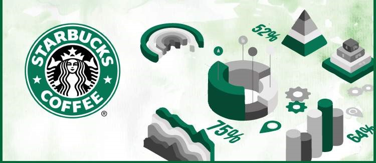

# Starbucks-Project

### Table of Contents
1. [Installation](#installation)
2. [Project Overview](#project)
3. [File Description](#file)
4. [Visualizations](#image)
5. [Licensing, Authors, and Acknowledgements](#licensing)

## Installation 

All the librarires required to run the code are mentioned in [requirements.txt](https://github.com/rahul385/Starbucks-Project/blob/master/requirements.txt).

To install Run: `pip install -r requirements.txt`

## Project Overview 
This project was originally used as a take-home assignment provided by Starbucks for their job candidates. This exercise involves an advertising promotion that was tested to see if it would bring more customers to purchase a specific product priced at $10. It costs the company 0.15 to send out each promotion. Ideally, we want to limit that promotion only to those that are most receptive to the promotion.

The objective is to devise a promotion strategy in order to maximize the following metrics.

* Incremental Response Rate (IRR)
IRR depicts how many more customers purchased the product with the promotion, as compared to if they didn't receive the promotion. Mathematically, it's the ratio of the number of purchasers in the promotion group to the total number of customers in the purchasers group (treatment) minus the ratio of the number of purchasers in the non-promotional group to the total number of customers in the non-promotional group (control).

* Net Incremental Revenue (NIR)
NIR depicts how much is made (or lost) by sending out the promotion. Mathematically, this is 10 times the total number of purchasers that received the promotion minus 0.15 times the number of promotions sent out, minus 10 times the number of purchasers who were not given the promotion.

## File Description 
    
* **starbucks.ipynb**: The jupyter notebook [starbucks.ipynb](https://github.com/rahul385/Starbucks-Project/blob/master/Starbucks.ipynb) includes data exploration, code, machine learning model and visualizations. I used XGBoost classification algorithms to train the model generated a higher NIR (Net Incremental Revenue) of $237.75.

* **starbucks.html**: Profiling report of the dataset used for data exploration.

* **Visualizations**: This folder contains the package files.
    * `Invariant_Metric-Hypothesis_Test.png` : Plot for hypothesis test on invariant metric
    * `Evaluation_Metric-Hypothesis_Test.png` : Plot for hypothesis test on evaluation metric
    * `Feature_Importance.png` : Feature importance of the model
    
* **Take_Home_Assignment.docx**: Full description of problem statement what Starbucks provides to their candidates.

* **test_results.py**: Python module that evaluates the model and compares accuracy of the model with a baseline IRR and NIR provided by Starbucks.

* **Test.csv**: Test dataset to evaluate the model accuracy.

* **training.csv**: Training dataset to train the model. 

## Screenshots 

***Screenshot 1: Plot for Hypothesis Test on Invariant Metric***

***Screenshot 2: Plot for Hypothesis Test on Evaluation Metric-***

***Screenshot 3: Feature Importance of the model***

## Licensing, Authors, Acknowledgements 
Author: Rahul Gupta Copyright 2021

Permission is hereby granted, free of charge, to any person obtaining a copy of this software and associated documentation files (the "Software"), to deal in the Software without restriction, including without limitation the rights to use, copy, modify, merge, publish, distribute, sublicense, and/or sell copies of the Software, and to permit persons to whom the Software is furnished to do so, subject to the following conditions:

The above copyright notice and this permission notice shall be included in all copies or substantial portions of the Software.

THE SOFTWARE IS PROVIDED "AS IS", WITHOUT WARRANTY OF ANY KIND, EXPRESS OR IMPLIED, INCLUDING BUT NOT LIMITED TO THE WARRANTIES OF MERCHANTABILITY, FITNESS FOR A PARTICULAR PURPOSE AND NONINFRINGEMENT. IN NO EVENT SHALL THE AUTHORS OR COPYRIGHT HOLDERS BE LIABLE FOR ANY CLAIM, DAMAGES OR OTHER LIABILITY, WHETHER IN AN ACTION OF CONTRACT, TORT OR OTHERWISE, ARISING FROM, OUT OF OR IN CONNECTION WITH THE SOFTWARE OR THE USE OR OTHER DEALINGS IN THE SOFTWARE.
